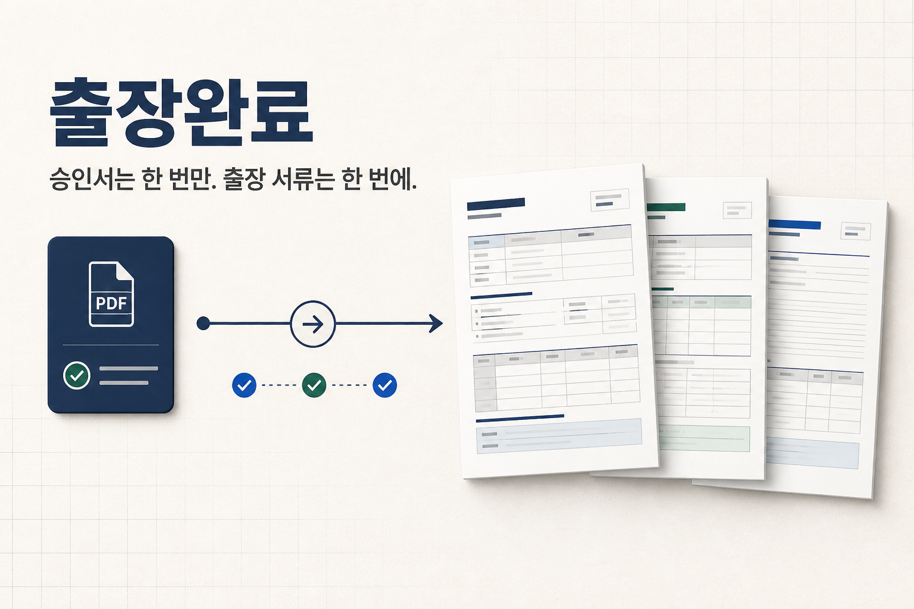
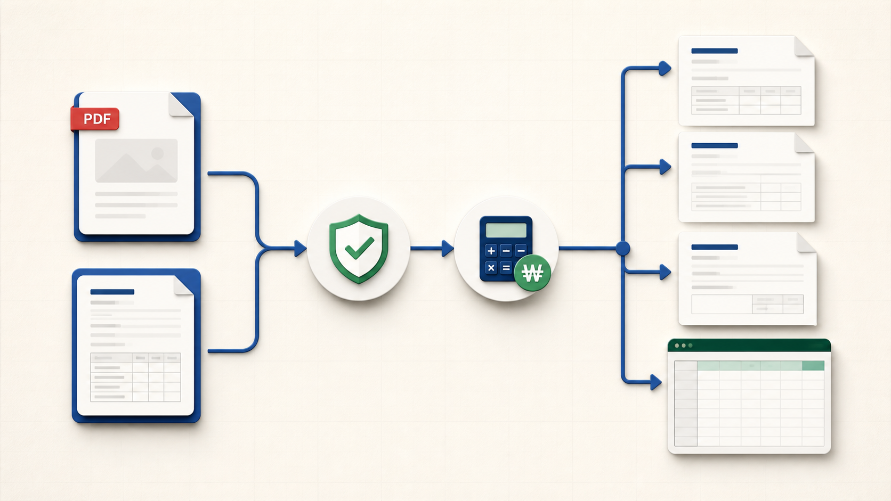
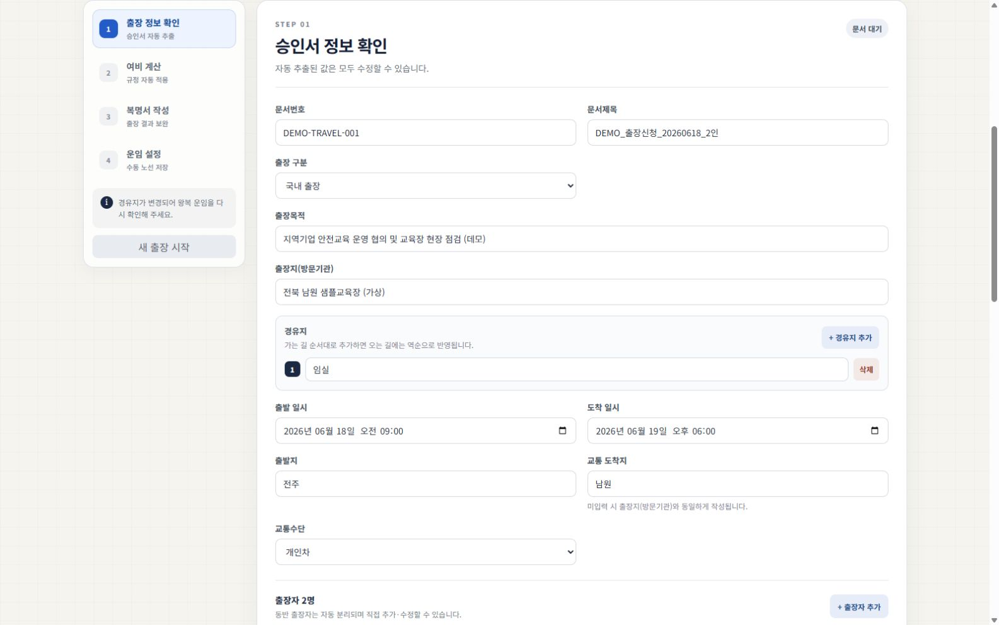
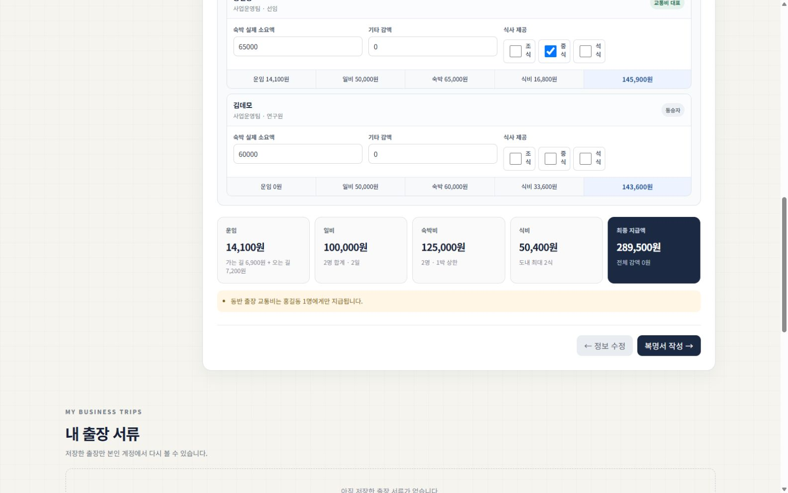
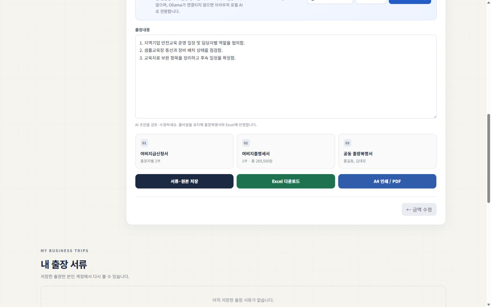

<p align="center">
  
</p>

<h1 align="center">출장서류 자동화 KR</h1>

<p align="center"><strong>승인서 확인부터 여비 계산, A4 제출서류까지 한 곳에서.</strong></p>

<p align="center">
  승인된 PDF·HWPX에서 출장 정보를 읽고, 설정된 여비 기준으로 금액을 계산해<br />
  여비지급신청서·여비지출명세서·출장복명서와 Excel을 준비하는 자체 배포형 한국어 웹앱입니다.
</p>

<p align="center">
  <a href="https://github.com/kkhinlove-design/travel-expense-automation-kr/actions/workflows/ci.yml"></a>
  <a href="https://github.com/kkhinlove-design/travel-expense-automation-kr/releases/tag/v1.0.0"></a>
  <a href="./LICENSE"></a>
</p>

<p align="center">
  <a href="#화면으로-먼저-보기"><strong>화면 보기</strong></a> ·
  <a href="#3단계-빠른-시작"><strong>직접 배포하기</strong></a> ·
  <a href="./docs/DEPLOYMENT.md"><strong>설치 문서</strong></a> ·
  <a href="https://github.com/kkhinlove-design/travel-expense-automation-kr/issues"><strong>이슈 제보</strong></a>
</p>

> [!IMPORTANT]
> 이 프로젝트는 도입 기관이 [`config/travel-policy.js`](./config/travel-policy.js)의 규정값과 문서 양식을 검토·조정해 사용하는 업무 보조 도구입니다. 자동 추출·계산 결과와 제출 서류는 담당자가 원문 규정 및 증빙과 대조한 뒤 확정해야 합니다.

## 왜 만들었나요?

전자결재로 승인된 출장신청서를 다시 열어 출장자, 일정, 장소와 운임을 Excel에 옮겨 적는 일은 반복적이지만 실수 비용은 큽니다. 이 프로젝트는 승인 문서 확인부터 계산, 복명, 출력까지 흩어진 작업을 하나의 흐름으로 연결합니다.

다음과 같은 조직에 특히 잘 맞습니다.

- 승인된 출장신청서를 다시 수기 입력하는 경영지원·총무 담당자가 있는 조직
- 공공기관, 재단, 산학협력단처럼 기관별 여비 규정과 정해진 제출 양식을 쓰는 조직
- 동반 출장자, 교통비 대표 수령, 경유지와 왕복 차등 운임을 자주 처리하는 조직
- 출장 문서와 개인정보를 자체 Supabase 프로젝트 안에서 관리하고 싶은 조직

## 한 건이 이렇게 끝납니다



1. **승인 문서 확인** — PDF, HWPX 또는 두 파일을 함께 올려 추출값과 동반 출장자를 확인합니다.
2. **여비 자동 계산** — 교통비 대표, 차량 유형, 숙박 상한, 제공 식사와 기관 규정을 사람별로 반영합니다.
3. **복명·제출** — 출장복명 내용을 보완하고 기존 방향의 A4 문서와 Excel을 내려받습니다.

## 화면으로 먼저 보기

아래 화면은 운영 DB나 실제 출장 문서를 사용하지 않고 만든 **가상 데모 데이터**입니다.

### 1. 승인 문서 확인

문서번호·목적·방문기관·일정과 경유지를 확인하고, 동반 출장자 및 교통비 대표를 보정합니다.



### 2. 출장자별 여비 계산

가는 길 6,900원, 오는 길 7,200원을 따로 반영하고 숙박비·제공 식사를 사람별로 계산한 예시입니다.



### 3. 복명서와 제출 서류 준비

복명 내용을 검토한 뒤 여비지급신청서, 여비지출명세서, 공동 출장복명서와 Excel을 한 흐름에서 준비합니다.



> 화면의 이름·기관·문서번호·일정은 모두 가상 데이터입니다.

## 핵심 기능

| 영역 | 지원 내용 |
| --- | --- |
| 입력 | 승인 PDF, 원본 HWPX 또는 두 파일 함께 업로드 · 표 구조 우선 추출 · 불일치 확인 |
| 출장 경로 | 여러 출장자 · 교통비 대표 1명 · 경유지 · 가는 길/오는 길 차등 운임 |
| 여비 계산 | 개인차·법인차·대중교통 · 장기 체류 · 제공 식사 · 지역별 숙박 상한 · 개인별 정산 |
| 산출물 | 여비지급신청서 · 여비지출명세서 · 출장복명서 · Excel · A4 인쇄/PDF |
| 운영 | 이메일/비밀번호 로그인 · 개인별 기본 출발 사무소 · 직원 계정 생성·편집·Excel 등록 · 공용 운임 Excel 등록 · 사용자별 저장·삭제 · 원본 보관 |
| 로컬 AI | PC의 Ollama 또는 지원 브라우저의 WebGPU로 출장복명서 초안 작성 |

## 도입 전에 확인하세요

- 기본 정책은 예시입니다. 기관 규정의 금액, 시행일과 예외 조건을 [`config/travel-policy.js`](./config/travel-policy.js)에서 검토하세요.
- 스캔 이미지만 있는 PDF에는 OCR을 적용하지 않습니다. 가능하면 원본 HWPX를 함께 사용하세요.
- 문서 양식이 달라지면 파서와 Excel 셀 매핑을 기관 양식에 맞게 보정해야 합니다.
- PDF와 HWPX 원본의 합계는 한 출장당 4MB 이하여야 합니다.
- 기본 구성은 한 기관이 별도 Supabase 프로젝트와 Vercel 배포를 운영하는 방식입니다.

## 3단계 빠른 시작

### 1. Supabase 준비

새 Supabase 프로젝트를 만들고 [Supabase 설정 안내](./docs/SUPABASE_SETUP.md)에 따라 데이터베이스 마이그레이션, 비공개 Storage 버킷, Edge Functions와 최초 관리자 계정을 준비합니다.

### 2. Vercel 배포

[][vercel-deploy]

배포 화면에서 Supabase URL, publishable key와 최초 관리자 이메일을 입력합니다. 쉬운 초기 설정은 같은 이메일을 Vercel의 `NEXT_PUBLIC_ADMIN_EMAIL`과 Supabase Function secret `ADMIN_EMAILS`에 모두 넣는 방식입니다. 이후 `app_metadata.role=admin`을 안전한 Admin API로 부여하면 이메일 fallback 없이 운영할 수 있습니다.

> Deploy 버튼은 앱을 복제·배포하지만 Supabase 스키마와 Edge Functions를 대신 적용하지 않습니다.

### 3. 연결 확인

Supabase Auth의 Site URL과 Redirect URL을 실제 Vercel 주소로 설정한 뒤 관리자 계정으로 로그인합니다. 직원 1명 생성, 샘플 문서 저장·삭제, A4 인쇄 미리보기를 차례로 확인하면 준비가 끝납니다.

자세한 운영 배포 절차는 [배포 안내](./docs/DEPLOYMENT.md)를 참고하세요.

## 기관에 맞게 바꾸기

| 바꿀 항목 | 설정 위치 |
| --- | --- |
| 앱 이름, 기관명, 출발 기준지 목록 | [`.env.example`](./.env.example)의 `NEXT_PUBLIC_*` 항목 |
| 일비·식비·숙박 상한과 차량 규칙 | [`config/travel-policy.js`](./config/travel-policy.js) |
| Excel 원본 양식 | [`public/templates/travel-template.xlsx`](./public/templates/travel-template.xlsx)와 [`lib/travel-excel.js`](./lib/travel-excel.js)의 셀 매핑 |
| 관리자 권한 | Supabase `app_metadata.role` 또는 Function secret `ADMIN_EMAILS` |
| 로컬 AI 모델과 연결 | [로컬 AI 설정](./docs/LOCAL_AI.md) |

## 로컬 개발

Node.js 22 이상이 필요합니다.

```bash
git clone https://github.com/kkhinlove-design/travel-expense-automation-kr.git
cd travel-expense-automation-kr
npm ci
cp .env.example .env.local
npm run dev
```

Windows PowerShell에서는 `cp` 대신 `Copy-Item .env.example .env.local`을 사용할 수 있습니다. 브라우저에서 `http://localhost:3000`을 여세요.

```bash
npm test
npm run build
```

## 환경변수

| 이름 | 필수 | 노출 범위 | 설명 |
| --- | --- | --- | --- |
| `NEXT_PUBLIC_SUPABASE_URL` | 예 | 브라우저 | Supabase 프로젝트 URL |
| `NEXT_PUBLIC_SUPABASE_PUBLISHABLE_KEY` | 예 | 브라우저 | Supabase publishable key. `service_role`/secret key를 넣지 마세요. |
| `NEXT_PUBLIC_ADMIN_ROLES` | 아니요 | 브라우저 | 관리자 UI가 인정할 `app_metadata` 역할. 기본값 `admin,super_admin` |
| `NEXT_PUBLIC_ADMIN_EMAIL` | 조건부 | 브라우저 | 쉬운 최초 설치용 관리자 UI 이메일. `app_metadata.role=admin`을 쓰면 생략 가능 |
| `DATA_GO_KR_SERVICE_KEY` | 아니요 | 서버 | TAGO 연동 서버 코드용 일반인증키. 현재 기본 UI는 비활성화되어 있으며 저장 운임·직접 입력을 우선 사용합니다. |

기관명·앱 이름·출발 기준지와 Ollama 모델 등 선택 설정은 주석이 포함된 [`.env.example`](./.env.example)에서 확인할 수 있습니다. 여러 사무소는 `NEXT_PUBLIC_ORIGIN_BASES`에 쉼표로 구분해 입력합니다. 로그인한 직원은 **환경 설정**에서 기본 출발 사무소를 저장할 수 있고, 출장마다 실제 출발지가 다르면 정보 확인 화면에서 바꿀 수 있습니다. `ALLOW_LOCAL_DEV_USER=true`는 Supabase 없이 UI를 확인하는 로컬 개발에서만 사용하고 Vercel에는 설정하지 마세요.

이메일 기반 초기 관리자를 사용할 때는 `NEXT_PUBLIC_ADMIN_EMAIL`과 별도로 Supabase Function secret `ADMIN_EMAILS`에도 같은 이메일을 설정해야 합니다. 전자는 UI 진입용 공개 힌트이고, 실제 관리자 작업 권한은 후자의 서버 allowlist가 검증합니다. 자세한 권한 구성은 [Supabase 설정 안내](./docs/SUPABASE_SETUP.md)를 따르세요.

실제 값은 `.env.local`, Vercel Environment Variables 또는 Supabase Function secrets에만 저장하세요. 비밀키를 Git, 이슈, 빌드 로그에 올리지 마세요.

## 개인정보와 로컬 AI

- PDF/HWPX 분석은 브라우저에서 이루어지며, 사용자가 **저장**할 때만 구조화된 출장 정보와 원본이 자신의 Supabase 프로젝트로 전송됩니다.
- Ollama는 브라우저가 `127.0.0.1:11434`에 직접 연결해 추론합니다. WebGPU 대체 모드도 프롬프트 추론을 브라우저 안에서 수행합니다.
- TAGO 조회 UI를 별도로 활성화하면 출발지·도착지·조회일이 앱 서버를 거쳐 공공데이터포털로 전송됩니다.
- 출장 문서에는 개인정보가 포함될 수 있습니다. 기관의 보존기간, 접근권한 및 파기 정책을 적용하세요.

세부 내용은 [개인정보 및 데이터 흐름](./docs/PRIVACY.md)과 [로컬 AI 설정](./docs/LOCAL_AI.md)을 확인하세요.

## 알려진 제한사항

- 구형 `.hwp`는 지원하지 않습니다. 한글에서 `.hwpx`로 다시 저장하세요.
- PDF와 HWPX 원본의 합계는 한 출장당 4MB 이하여야 합니다.
- 스캔 이미지만 있는 PDF는 OCR이 없어 자동 추출 정확도가 낮습니다.
- 문서 양식이 달라지거나 표가 크게 수정되면 추출값을 직접 보정해야 합니다.
- TAGO 운임 조회 UI는 기본 구성에서 비활성화되어 있습니다. 저장 운임 또는 실제 증빙 금액을 입력하세요.
- 브라우저, 프린터 드라이버, 여백 설정에 따라 출력 결과가 달라질 수 있습니다. Chrome/Edge의 A4 미리보기에서 배율 100%와 배경 그래픽을 확인하세요.
- 기본 구성은 한 기관이 별도 Supabase 프로젝트와 배포를 운영하는 방식입니다. 여러 기관을 한 배포에 혼합하는 멀티테넌시는 제공하지 않습니다.

## 문서

- [Supabase 설정](./docs/SUPABASE_SETUP.md)
- [Vercel 및 운영 배포](./docs/DEPLOYMENT.md)
- [로컬 AI와 Ollama](./docs/LOCAL_AI.md)
- [개인정보 및 데이터 흐름](./docs/PRIVACY.md)
- [기여 방법](CONTRIBUTING.md)
- [보안 정책](SECURITY.md)

## 기여

버그 재현, 양식 호환성 개선, 테스트 보강을 환영합니다. 개인정보가 포함된 실제 출장 문서는 이슈나 PR에 첨부하지 말고 재현용으로 비식별화한 최소 샘플을 사용해 주세요. 자세한 절차는 [CONTRIBUTING.md](CONTRIBUTING.md)를 확인하세요.

## 프로젝트가 도움이 됐다면

실무에 도움이 될 것 같다면 저장소에 ⭐를 남겨 주세요. 양식 호환성 제보와 작은 개선 PR도 프로젝트를 더 많은 조직이 쓸 수 있게 만드는 큰 도움이 됩니다.

## 라이선스

[MIT License](LICENSE)

[vercel-deploy]: https://vercel.com/new/clone?repository-url=https%3A%2F%2Fgithub.com%2Fkkhinlove-design%2Ftravel-expense-automation-kr&project-name=travel-expense-automation-kr&repository-name=travel-expense-automation-kr&env=NEXT_PUBLIC_SUPABASE_URL%2CNEXT_PUBLIC_SUPABASE_PUBLISHABLE_KEY%2CNEXT_PUBLIC_ADMIN_EMAIL&envDescription=Supabase%20URL%2C%20publishable%20key%EC%99%80%20%EC%B5%9C%EC%B4%88%20%EA%B4%80%EB%A6%AC%EC%9E%90%20%EC%9D%B4%EB%A9%94%EC%9D%BC%EC%9D%84%20%EC%9E%85%EB%A0%A5%ED%95%98%EC%84%B8%EC%9A%94.%20%EA%B0%99%EC%9D%80%20%EC%9D%B4%EB%A9%94%EC%9D%BC%EC%9D%84%20Supabase%20Function%20secret%20ADMIN_EMAILS%EC%97%90%EB%8F%84%20%EC%84%A4%EC%A0%95%ED%95%A9%EB%8B%88%EB%8B%A4.&envLink=https%3A%2F%2Fgithub.com%2Fkkhinlove-design%2Ftravel-expense-automation-kr%2Fblob%2Fmain%2Fdocs%2FSUPABASE_SETUP.md
